# AgentVerse

## Overview

AgentVerse is an Android application designed to integrate and orchestrate multiple AI agents within a unified architecture. This project provides a scalable foundation for building AI-powered mobile experiences using modular clean architecture.

---

## Architecture & Modules

AgentVerse is structured for production-level scalability and maintainability. The architecture separates UI, orchestration, agents, tools, and model connectors into distinct modules:

```
app
ui-common
core
agent
api-integration
api-integration-common
data
```

### Module Responsibilities

- **app**: Android entry layer. Handles navigation, dependency injection (Hilt), configuration, and ViewModels. Connects UI to core logic. No business or orchestration logic.
- **ui-common**: Reusable UI components and design system (themes, buttons, chat bubbles, etc.).
- **core**: The brain. Contains the agent orchestrator, context manager, tool registry, and base interfaces for extensibility.
- **agent**: Individual agent implementations (e.g., ChatAgent, CodeAgent). Each agent is modular and uses core and API integrations.
- **api-integration**: Model connectors for external AI services (OpenAI, Gemini, Claude, local LLMs). Handles networking and authentication.
- **api-integration-common**: Shared DTOs, base models, error handling, and API contracts.
- **data**: Storage layer for chat history, caching, tokens, and user sessions. Organized into local, remote, and repository submodules.

### Diagrams

<figure style="max-width:800px; width:100%; margin:0 auto;">
  
  <figcaption>Module relationships and dependencies</figcaption>
</figure>

<br>
<br>
<figure style="max-width:800px; width:100%; margin:1rem auto 0 auto;">
  
  <figcaption>Runtime sequence showing message flow between components</figcaption>
</figure>

---

## License

```
MIT License

Copyright (c) 2026 Ayaan Ansari

Permission is hereby granted, free of charge, to any person obtaining a copy
of this software and associated documentation files (the "Software"), to deal
in the Software without restriction, including without limitation the rights
to use, copy, modify, merge, publish, distribute, sublicense, and/or sell
copies of the Software, and to permit persons to whom the Software is
furnished to do so, subject to the following conditions:

The above copyright notice and this permission notice shall be included in all
copies or substantial portions of the Software.

THE SOFTWARE IS PROVIDED "AS IS", WITHOUT WARRANTY OF ANY KIND, EXPRESS OR
IMPLIED, INCLUDING BUT NOT LIMITED TO THE WARRANTIES OF MERCHANTABILITY,
FITNESS FOR A PARTICULAR PURPOSE AND NONINFRINGEMENT. IN NO EVENT SHALL THE
AUTHORS OR COPYRIGHT HOLDERS BE LIABLE FOR ANY CLAIM, DAMAGES OR OTHER
LIABILITY, WHETHER IN AN ACTION OF CONTRACT, TORT OR OTHERWISE, ARISING FROM,
OUT OF OR IN CONNECTION WITH THE SOFTWARE OR THE USE OR OTHER DEALINGS IN THE
SOFTWARE.
```
